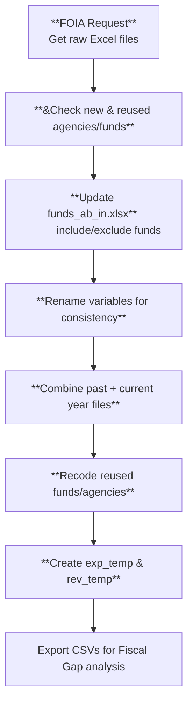

- This document was created by Jahun Lee to better understand how the Fiscal Futures Project operates for himself as an RA without background in a financial management student and not familiar with the U.S. tax system.
	- The goal of this document is to provide all the information in one place. 
		- Because it seems the information about the Fiscal Futures Project, particularly its methodology, is fragmented, at least for Jahun. 


---

MoC


##
- (Excerpt from `FF documentation.docs`)

###### The Structural Budget Gap

- The Structural Budget Gap 
>$$예산 격차 = 총수입 – 총지출$$  >>격차가 0이면 예산은 균형이며, 곧 **총수입 = 총지출**입니다.  
>> 격차가 양(+)이면 **흑자**로, **총수입 > 총지출**일 때 발생합니다.  
>> 격차가 음(–)이면 **적자**로, **총수입 < 총지출**일 때 발생합니다.

>일리노이 주 헌법(제8조 제2절)
>> “재정연도에 대한 세출승인은 그 해에 이용 가능하다고 총회(General Assembly)가 추산한 자금을 초과할 수 없다.” 

- “이용 가능하다고 추산한 자금”
	- 세금과 수수료에서 발생할 것으로 예상되는 수입
	- 기존 자산 잔액이나 새로운 차입 
	
- 과거 여러 해에 걸쳐 축적된 자산 잔액으로 현재 지출을 충당하거나, 향후 여러 해에 걸쳐 상환해야 할 새로운 부채를 떠안는 것과, 매년 발생하는 세금·수수료의 유입(흐름)으로 지출을 충당하는 것 사이에는 큰 차이가 있습니다. 

- **주의 근본적 재정 상태는 실제 지출과 실제 수입을 비교함으로써 더 잘 측정됩니다**
	- 주의 기초적인 재정 상태는 자산 잔액의 일회성 사용이나 신규 차입을 무시하고, 지출을 세금·수수료의 연간 유입과 비교함으로써 더 잘 측정됨
	- 재정연도가 시작되기 전에 “이용 가능하다고 추산한 자금”에 의존하면, 실제 연말 수입이 장밋빛 전망치보다 훨씬 낮게 나타나더라도, 낙관적 수입 전망만으로 균형예산 요건을 충족할 수 있습니다. 


- “총수입”을 “계정 잔액 및 신규 차입금 수입을 포함한 총 가용자금” 대신 사용함으로써, 이 지표는 지속가능한 수입에 초점을 맞추고 그 결과 기초적인 재정 상태를 반영합니다. 
- 이 개념에 더 나은 명칭은 “구조적 예산 격차”일 수 있으며, 이는 지속가능한 수입과 비교한 주 지출 수준을 측정하거나 전망하려는 다른 연구들에서 사용하는 “구조적 적자” 개념과 맥을 같이합니다.


## The All Funds Budgets

#### General Funds
 
 - **General Funds** that reported by the State is not consistently defined over time.
	- It is difficult to obtain an accurate time series data of state revenue and expenditures. 
	- In addition, it's common for there to be within-year transfers between funds and cross-year reassignments of spending responsibility across funds.


	- 일리노이 주 헌법은 “재정연도에 대한 세출승인은 그 해에 이용 가능하다고 총회가 추산한 자금을 초과할 수 없다”고 명시함.  그러나 일리노이 법은 “이용 가능한 자금”에 채무 발행, 일회성 수입원, 자산 매각 등을 포함할 수 있도록 허용함. 
		- 예를 들어, 주가 톨 운영(toll booth operations)을 민간에 매각하는 경우, 해당 연도의 수입원으로 계상할 수 있습니다. 

감사원의 일부 보고는 “총 세출승인 및 비승인 기금(Total Appropriated and Non-Appropriated Funds)”을 다루지만, 이 지표에는 같은 해 여러 기금을 경유하는 수입의 이중계상이 일부 포함됩니다.
- 또한, 승인(appropriated) vs 비승인(non-appropriated)의 구분은 해당 자원이나 지출이 진정한 주(州) 자원·기능인지 여부를 나타내지 않습니다. 
	- 일부 경우에는, 특수기금(special funds)에서 승인 형태로 지출되지만, 그 기금 자체는 지방이 부과한 세금을 담고 있기도 합니다. 
	- 또 일부 비승인 기금은 주가 부과한 세금을 보유합니다. 
	- 주지사 운영예산(Governor’s Operating Budget)은 “모든 승인기금(All Appropriated Funds)”을 보고하지만, 동일한 한계가 적용됩니다. 


- Illinois' **General Funds**
	- the IOC and political and public discussion of the Illinois state budget, the concept of General Funds is used.
	- Illinois has 7 General Funds (at least since FY2022)
		- but over 700 funds in total (over 1,100 across the years in our database)
		- **7 General Funds in the State of Illinois system**
			- General Revenue Fund (0001)
			- General Revenue–Common School Special Account Fund (0005) 
			- Common School Fund (0412)
			- Education Assistance Fund (0007)
			- Fund for the Advancement of Education (0640)
			- Commitment to Human Services Fund (0644) 
			- Budget Stabilization Fund (0686)

		- 일리노이는 대부분의 주와 달리 일반기금이 하나가 아니라 여러 개 있음
			- 각 기금에는 특정 수입원이 있습니다. 
			- 교통 지출이 일반기금에서 집행되지 않음.


- Weakness of General Funds
	- 일반기금 vs 전기금: 범주 수의 차이
		- 일반기금으로 분석을 제한하면 교통 예산의 주요 부분, 부채 서비스, 지방정부로의 수입 이체, 연방기금으로 재원 조달되는 많은 프로그램 등 여러 중요한 수입·지출 범주가 제외됩니다.
	- 일반기금 구성요소의 변동성 증가
		- 어떤 항목에 대한 주의 지불 방식이 해마다 변동되는 경우가 많아, 일반기금만 보면 연도 간 변화가 실제보다 더 크게 보일 수 있음
			- 예컨대 어떤 연도에는 연방 프로그램 자금이 특정 주 특수기금에 예치되어 사용되다가, 다음 해에는 동일한 프로그램 지출이 일반기금에서 나오면, 지출 증가처럼 보이지만 실제로는 그렇지 않습니다. 
			- 반대로 일반기금에서 특수기금으로 재배정되면 지출 감소로 보이지만 실제로는 아닙니다.
	- 일반기금 보고 총계에 포함된 비일반기금과의 이전(Transfer)
		- 일반기금 수입에는 비일반기금으로부터의 유입이 포함되기도 하고, 일반기금 지출에는 비일반기금으로의 이전이 포함되기도 합니다. 
			- 이러한 이전의 포함 여부가 시간에 따라 달라지면 주 예산 상황 변화의 크기를 흐릴 수 있습니다. 
			- 더 포괄적인 예산 개념일수록 기금 간 이전분이 상계될 가능성이 큽니다.

#### All Funds
- FF reports a more inclusive concept which called as "All Funds".
- To conduct meaningful analysis, FF reconstruct the entire set of Illinois revenue and expenditure categories in a consistent manner over time.
	- FF focuses on "sustainable revenue" by excluding new borrowing and other one-time revenue sources.
- FF's All Funds measure includes funds that hold state resources, eliminates local resources, and corrects for inaccurate reporting practices (e.g., double-counting, fund-shifting, and year-to-year reporting changes)
- FF argues that All Funds Model represents the total burdens and benefits of state government to taxpayers and residents. 
	- For a detailed rationale of our choice to concentrate on All Funds versus General Funds see our "Why Ignore or half of the Illinois state budget picture? Consolidation of General and Special Fund Reporting," (July 2011).[[1]](#_ftn1)


## 전기금(All Funds) 예산에 개별 기금을 포함하는 기준

앞서 전기금 개념이 시간에 따라 정의가 좁고 일관되지 못한 일반기금보다 주의 실제 재정 상황을 더 잘 보여준다고 설명했습니다. 다만 “전(全)”이라는 단어는 약간의 오해 소지가 있습니다. 일리노이의 700개+ 기금의 절대다수는 전기금 지표에 포함되지만, 일부는 그렇지 않습니다. 전기금 목록의 출발점은 모든 승인기금이지만, 아래 이유들로 소수의 승인기금을 제외하고, 여러 비승인 기금을 포함합니다.

### 전기금 포함 여부를 판단하는 기준

**기준 1: 그 기금이 주(州)가 부과하는 세금을 징수한다면 포함(INCLUDE).**  
주는 주세와 지방세(보통 지방선택적 판매·유틸리티세)를 모두 징수합니다. 주는 지방세를 징수해 지방정부에 환급합니다. 수납 시, 지방세 수입은 특정 지정 비승인 신탁기금에 예치됩니다. 주가 단순히 지방 과세기관의 징수 대행자 역할을 하는 경우, 해당 수납 신탁기금과 그 수입·지출은 분석 틀에 **포함되지 않습니다**. 반면 그 세금이 주를 위해 징수되는 경우, 기금과 그 수입은 **포함됩니다**. 개인소득세, 일반판매세, 기업소득에 대한 개인재산대체세(PPRT), 공공유틸리티, 유류세, 교통 갱신 기금에 대한 지방 몫에서 **지방정부 이전(Local Government Transfers)** 지출 범주를 구성합니다(코드의 “Local Transfers” 섹션).

**기준 2: 그 기금이 주 기능(state function)을 지원한다면 포함.**  
비승인 기금이라도 교육, 사회복지, 교통, 공공시설, 규제, 천연자원, 법집행 등 주 기능을 지원할 수 있습니다. 일반적으로 이는 특정 주 사업이나 목적을 위해 연방 자금을 보유하는 신탁기금입니다. 이 범주는 사실상 많은 승인된 주·연방 신탁기금 그룹과 동일합니다. 우리는 연방 자금을 수입으로 계상하므로, 승인기금은 포함하면서 본질적으로 동일한 기능을 하는 비승인 기금을 포함하지 않는 것은 일관적이지 않습니다.

**기준 3: 개인의 자금을 보유하는 기금이라면 제외(EXCLUDE).**  
개인의 돈을 보관하는 데 사용되는 기금이 있습니다. 대부분 비승인 기금이지만 일부는 승인 기금입니다. 제외 사례로는 자녀양육비 징수기금이나 직원 연금 본인부담 기금 등이 있습니다. 이러한 기금은 개인에게 속하는 돈을 보관하고 있으며 나중에 그 사람에게 반환되거나 그 사람을 위한 지불에 사용됩니다.

**기준 4: 그 기금의 지출 또는 수입이 다른 곳에서 이미 계상되었다면 제외(이중계상 방지).**  
일부 기금은 이미 다른 기금의 수입 또는 지출로 계상된 자금을 수납·지출합니다. 예컨대 Commercial Consolidation Fund는 개인·서비스 제공자·지방정부에 대한 주 급부 지급을 전자이체로 집행하는 대형 기금입니다. 이 기금으로의 **유입**은 계상되지만, 이 기금에서의 **지급**은 계상되지 않습니다.

**기준 5: 공적 기능이 아닌 특정 목적에 지정된 사용자 수수료를 보관하는 기금(도관·conduit)은 제외.**  
통상 우리는 공적 필수 기능이 아닌 특정 목적을 위해 지정된 사용자 수수료를 보관하는 비승인 기금을 제외합니다. 이러한 기금은 도관으로 간주될 수 있으며 틀에 포함하지 않았습니다. 예로, 주 박람회에서 마권경주 참가자에게서 수수료를 징수하여 경주 우승자에게 지급하는 Fund 0098을 제외합니다.

**기준 6: 대규모·중요한 주 기능을 지원하는 사용자 수수료 징수 기금이라면 포함(주 기능이 사용자 수수료 논리를 상회).**  
사용자 수수료로 지원되면서 **주 기능**(예: 교통)을 수행하는 비승인 기금은 틀에 포함합니다. 그 이유는, 설사 사용자 수수료와 기금 구조가 없더라도 주 기능은 수행되어야 하기 때문입니다. 가장 큰 예는 일리노이 주 유료도로 수입기금(Illinois State Toll Highway Revenue Fund)으로, 통행료를 징수하여 일리노이 유료도로의 확장 및 유지보수를 지원합니다.


## 전기금 데이터베이스의 데이터 출처

- FF's All Funds database comes from the Illinois Comptroller's Office (IOC).
	- Currently the database includes 300,000 individual records for fiscal years 1998 to 2022
- Fiscal Futures 전기금 데이터베이스의 정보는 일리노이 감사원에서 제공한 상세 자료에 기반합니다. 현재 데이터베이스에는 1998~2022 회계연도에 대한 30만 개의 개별 기록이 포함되어 있습니다.

**지출 데이터.** 
- 각 지출 기록에 포함된 주요 정보는 회계연도, 기금, 기관, 객체(object), 세출승인입니다. 
- 지출을 범주로 집계하는 핵심 기준(아래 설명)은 해당 지출에 책임이 있는 주 정부 기관입니다.
- 현재 데이터셋에는 129개의 개별 기관이 있습니다. 
	- 다음 절에서는 이를 연도 전체에 걸쳐 포괄적이며 일관되게 정의된 더 적은 수의 범주로 축약하는 방법을 다룹니다. 
		- 재코딩 과정에 대한 세부사항은 R 코드 전반의 주석을 참고하십시오.

**수입 데이터.** 
	- 각 수입 기록에 포함된 주요 정보는 회계연도, 기금, 기관, 수입원(source)입니다. 
	- 감사원 웹사이트의 정보를 사용하여 2,137개의 상세 수입원 코드를 33개의 더 넓은 수입 유형 코드로 통합하며, 그 목록은 다음 절에 제시되어 있습니다. 
		- 재코딩 과정의 세부는 R 코드의 주석을 참고하십시오.


~~아래에는 Fiscal Futures Project 전기금 예산의 각 지출 및 수입 범주가 나열되어 있습니다. 각 항목에는 보다 설명적인 제목 버전 또는 포함된 주요 구성 기관이나 수입원 목록이 포함됩니다. 설명과 목록은 포괄적이지 않으며, 많은 소규모 구성요소는 포함하지 않습니다.~~


## Source of Data for All Funds Database

- Information for the FF All Funds database comes from the IOC. 
	- Currently the database includes ==300,000== individual records for FY 1998 - ==2022==
	

- Expenditure data
	- The principal information included in each spending record is ***fiscal year, fund, agency, object, and appropriation***
	- The key measure to aggregate spending into categories is the state ***agency*** responsible for the expenditure.
	- ==Link to R code==

- Revenue data
	- the principal information included in each revenue record is ***fiscal year, fund, agency, and source***. 
	- Information from the Comptroller's website is used to collapse the 2,137 detailed ***source*** codes into 33 broader revenue ***type*** codes.
	- ==Link to R code==


### Expenditure Categories


- 대부분의 경우, 지출 범주는 고유한 그룹 코드(agency code와 대응됨)가 부여된 주(州)의 “부서(department),” “지부(branch),” “기관(agency),” “위원회(board),” 또는 “위원회(commission)”와 같음. 
- 일부 중요한 예산 범주들은 여러 부서나 기관의 운영 예산 일부로 보고되지만, 별도의 분석이 필요함
	- quasi-agencies
		- 연금, 부채 상환, 주(州) 공무원 의료보험, 메디케이드, 지방정부로의 수입 이전에 대한 지출 
	- 고유 기관 코드를 가진 지출 범주
	- 여러 소규모 기관들의 통합


##### Quasi-Agencies
	- the following categories are separated from other agency budgets
		- 901. Pension Contributions
		- 903. Debt Service
		- 904. State Employee Health Care
		- 945. Medicaid
		- 970. Transfer of Revenue to Local Governments
- **901. Pension Contributions** (*Not used for FY2024 onward. Pension expenditures stay in their.*)
	- **Fiscal Futures only includes the state’s payments into the pension funds and employer contributions as "pension expenditures."**
	- State payments to the following pension systems:
		- 593.  Teachers Retirement System (TRS)
		- 589.  State Employee Retirement System (SERS)
		- 693.  State University Retirement System (SURS)
		- 275.  Judges Retirement System (JRS)
		- 131.  General Assembly Retirement System (GARS)
	- **Object = 4430**, 
			- **Funds 0473, 0477, 0479, 0481, (TRS, JRS, SERS, GARS),** 
			- **Funds  0755, 0786, 0787, 0788, 0789 (deferred compensation plan, GAR excess benefit, JRS excess benefit, SER excess benefit, TRS excess benefit),** 
			- are all funds that cover appropriations for benefit payments, pension income, and annuities to employees that worked for the State. 
			- All of the expenditures from these funds were set to in_ff =0 and therefore **NOT included** in aggregate pension expenditures in the analysis.
		
	- **Fund 0825 is** for the pension obligation acceleration bond and is also **excluded** from the analysis.
		-  **Object = 4431** is for state payments **into** pensions and **is included** in the analysis**. 
	- **Object 1160-1165** are employer contributions (mostly SERS) and also **included**.
	- **Agencies 131, 275, 586, 589, 593, 594, 693**
	
		|                                                | Pensions Separated<br>FY2020?-2023 | Pension Expenditures left in Agency Groups<br>FY 2024 + |
		| ---------------------------------------------- | ---------------------------------- | ------------------------------------------------------- |
		| 593 & 594. Teachers Retirement System (TRS)    | 901. State Pension Contribution    | 959. K-12 Education                                     |
		| 589. State Employee Retirement System (SERS)   | 901. State Pension Contribution    | 948. Other Departments                                  |
		| 693. State University Retirement System (SURS) | 901. State Pension Contribution    | 960. Higher Education                                   |
		| 275. Judges Retirement System (JRS)            | 901. State Pension Contribution    | 920. Judicial                                           |
		| 131. General Assembly Retirement System (GARS) | 901. State Pension Contribution    | 910. Legislative                                        |
- **903. Debt Service.**  
	- Interest payments on both short-term and long-term debt.  
	- **We do not include escrow payments or principal payments.**
		- Bond proceeds are not a sustainable revenue source and principal payments are not considered a cost for short term borrowing and general obligation bonds. 
		- There has been discussion on including general obligation debt service principal payments as an expenditure based on capital budgeting theory of debt being a proxy for capital depreciation. 
		- However if principal payments are included, then they are being counted twice: Once as the spending category that the money was spent on and again as “debt service” payments later.
	- However, overall debt (new and paid back) should be tracked and commented on separately.
	- Excludes Tollway Debt (principal and interest payments are combined in one observation). 
		- It is possible to look at the principal to interest ratio for capital debt and estimate the principal & interest ratio for the tollway if we wanted to do that.
- **904. State Employee Health Care.**  
	- Sum of expenditures for "health care coverage as elected by members per state employees group insurance act."  
	- The payments are made from the Health Insurance Reserve Fund.  
	- We subtract the share that came from employee contributions to create a net healthcare cost for the state and exclude the employer group contributions to avoid double counting the costs (employer group contributions & provision of healthcare costs are both included in the expenditure data).
	-  *turns specific items into State Employee Healthcare (agency=904)*
		```r code
		fund=="0907" & (agency=="416" & appr_org=="20") ~ "904",        # central management Bureau of benefits using health insurance reserve_
		
		fund=="0907" & (agency=="478" & appr_org=="80") ~ "904",       # agency = 478: healthcare & family services using health insurance reserve - stopped using this in 2012_
		
		TRUE ~ as.character(agency)))
		```
- **945. Medicaid.**  
	- That sum of the Healthcare and Family Services (or Public Aid in earlier years, _agency_ code 478) expenditures for Medical (_appr_organization_ code 65) with awards and grants (_object_ codes 4400 and 4900).  
	- Medicaid as a spending category includes healthcare provider support funds for services. 
	- For FY 2021 and FY 2022, State CURE dollars (fund == “0324”) were included in the Medicaid spending category due to sharing the fund number, appr_organization, and object codes with other federally supported healthcare expenditures.
- **970. Transfer of Revenue to Local Governments.**  
	- The share of certain taxes levied state-wide at a common rate and then transferred to local governments.  
		- (Purely local-option taxes levied by specific local governments with the state acting as collection agent are _not_ included in the model).
	- The five corresponding revenue-source items are:
		- 02.  Local share of Personal Income Tax
		- 03.  Personal Property Replacement Tax on Business Income
		- 06.  Local share of General Sales Tax
		- 09.  Local share of Motor Fuel Tax & Transportation Renewal Fund
		- 12.  Personal Property Replacement Tax on Public Utilities


##### Single agencies that function as expenditure categories.  
	- After removal of items described above. 


- 4**02.  Aging**, Department of
- **406.  Agriculture**, Department of (includes: 538. Farm Development Authority; 556 Rural Bond Bank – old agencies)
- **418.  Children and Family Services**, Department of
- **420.  Commerce and Economic Opportunity,** Department of
- **422.  Natural Resources**, Department of
- **425. Juvenile Justice,** Department of
- **426.  Corrections**, Department of
- **427.  Employment Security**, Department of
- **444.  Human Services**, Department of
- **478.  Healthcare & Family Services**, Department of (net of 945. Medicaid)
- **482.  Public Health**, Department of
- **492.  Revenue**, Department of
- **494.  Transportation** (net Local Share)– e.g. public transportation, railroads, construction, equipment, maintenance
- **532.  Environmental Protect Agency** – e.g. Air pollution control, land pollution control, clean water programs, stormwater management.
- **557.  Illinois State Toll Highway Authority** – e.g.  tollway capital Improvement, maintenance. Principal and interest are included as Tollway expenditures since they are combined in the data.
- **684.  Illinois Community College Board**
- **691.  Illinois Student Assistance Commission**
###### Combination of multiple smaller agencies. 
- **970. Central Services**
	- 416.  Central Management Services
	- 448. Innovation and Technology
- **910. Legislative**.  Combination of
	- 101.  General Assembly
	- 102.  Office of the Legislative Inspector General
	- 103.  Office of the Auditor General
	- 105.  Commission on Government Forecasting & Accountability (COGFA)
	- 108.  Legislative Information System
	- 109.  Legislative Audit Commission
	- 110.  Legislative Printing Unit
	- 115.  Legislative Reference Bureau
	- 120.  Legislative Ethics Commission
	- 156.  Office of the Architect of the Capitol
	- 167.  Joint Committee on Administrative Rules

	 - _Past Legislative:_
		 - _107. Commission on Intergovernmental Cooperation_
		- _112.  Legislative Research Unit_
		 - _155.  Legislative Space Needs Commission_
		- _140.  Pension Laws Commission_
- **920.       Judicial**.  Combination of
	- 201.  Supreme Court
	- 210.  Supreme Court Historic Preservation Commission
	- 280. Courts Commission
	- 285.  Judicial Inquiry Board
	- 290.  State Appellate Defenders Office
	- 295.  State's Attorneys Appellate Prosecutor
	- 528.  Court of Claims
     -   _Past agencies:_
	- _202.  Attorney Registration and Disciplinary Commission_
	- _203.  Board of Admissions to the Bar_
	- _205.  Clerk of the Supreme Court_
	- _215.  Appellate Court District 1_
	- _225.  Appellate Court District 2_
	- _235.  Appellate Court District 3_
	- _245.  Appellate Court District 4_
	- _255.  Appellate Court District 5_
- **930.       Elected Officers**.  Combination of
	- 310.  Governor
	- 330.  Office of the Lt. Governor
	- 340.  Office of the Attorney General
	- 350.  Secretary of State
	- 360.  Illinois Office of the Comptroller
	- 370.  State Treasurer's Office
- **941.       Public Safety**.  Combination of
	- 425.  Department of Juvenile Justice
	- 466.  Military Affairs
	-  493.  Department of State Police
	- 546.  Illinois Criminal Justice Information Authority
	- 569.  Law Enforcement Training and Standards Board
	- 578.  Prisoner Review Board
	- 583.  Sex Offender Management Board
	- 588.  Illinois Emergency Management Agency
	- 591.  Illinois State Police Merit Board
	- 592.  Office of the State Fire Marshal
- **944.       Business & Professional Regulation**.  Combination of
	- 440.  Department of Financial and Professional Regulation
	- 446.  Department of Insurance
	- 524.  Illinois Commerce Commission
	- 563.  Illinois Workers' Compensation Commission
- **946.       Capital Improvement**.  Combination of
	- 511.  Capital Development Board
	554.  Illinois Sports Facilities Authority
	574.  Metropolitan Fair and Exposition Authority
	598.  Upper Illinois River Valley Development Authority
- **948.       Other Departments**.  Combination of
	442.  Department of Human Rights
	445.  IL Power Agency
	452.  Department of Labor
	458.  Illinois Lottery
	497.  Department of Veterans Affairs
	507.  Governor's Office of Management and Budget
	- **_Non-pension items from pension departments_**
		- 131. General Assembly Retirement System
		- 275. Judges Retirement System
		- 589. State Employees’ Retirement System
		- 593. Teachers’ Retirement System
		- 594. Teachers’ pension and retirement system
		- 693. State University Retirement System
- **949.       Other Boards & Commissions**.  Combination of
	503.  Illinois Arts Council
	509.  Office of the Executive Inspector General
	510.  Executive Ethics Commission
	517.  Illinois Civil Service Commission
	526.  Deaf and Hard of Hearing Commission
	527.  Comprehensive Health Insurance Board
	529.  East St. Louis Financial Advisory Authority
	1. Committee on Equity and Inclusion
	534.  Health Information Exchange Authority
	537.  Guardianship and Advocacy Commission
	540.  Illinois Health Care
	541.  Historic Preservation Agency
	542.  Human Rights Commission
	548.  Illinois Education Labor Relations Board
	555.  Illinois State Board of Investments
	558.  Illinois Council on Developmental Disabilities
	559.  Illinois Violence Prevention Authority
	562.  Procurement Policy Board
	564.  Illinois Independent Tax Tribunal
	565.  Illinois Gaming Board
	567.  Liquor Control Commission
	571.  Medical Center Commission
	575.  Prairie State 2000 Authority
	579.  Illinois Racing Board
	580.  Property Tax Appeal Board
	587.  Illinois State Board of Elections
	590.  Illinois Labor Relations Board
   -     _Past Boards & Commissions:_
		- _525. Drycleaner Commission_
		- _568. IL Charter Schools Commission_
		- _585. Southwestern Development Authority_
- **959. K-12 Education** - eg. After school programs, charter schools, breakfast/lunch programs, commodities, etc.
	- 586.  Illinois State Board of Education (net of special education funds to 945. Medicaid).
- **960. University Education.**  State contributions to higher education.  Note this does not include the entire budget of the schools, only the amount they get from the state.
	601.  Board of Higher Education
	608.  Chicago State University
	612.  Eastern Illinois University
	616.  Governors State University
	620.  Northeastern Illinois University
	628.  Western Illinois University
	636.  Illinois State University
	644.  Northern Illinois University
	664.  Southern Illinois University
	676.  University of Illinois
	692.  Illinois Math and Science Academy
	695.  State Universities Civil Service Merit Board


# Methodology

#### Brief History of the Project
- 2016년 이전에는 일부 집계된 데이터가 감사원(Comptroller) 웹사이트와 그들의 『상세 연간보고서』 PDF 파일에서 수작업으로 수집되었습니다. 
- 2022년에는 모델을 구동하던 Stata 코드를 R로 재코딩하여 공개했습니다.


## Files


###### Raw Files

- `allrevfiles` : raw data from IOC 
- `allexpfiles` : raw data from IOC

>These files are not reflected the changed names of funds and agencies. 
	- variable names might be modified for consistency
###### Processed Files
- [funds_ab_in.xlsx](#^fd7c78)
- 


### funds_ab_in.xlsx

^fd7c78

- 1998년 이후 존재한 모든 기금, 현재 존속 여부, 다양한 목적을 위해 번호가 재사용되었는지 여부, 그리고 IOC가 매년 사용하는 신규 기금 번호가 담겨 있음

- new or reused funds
- reused funds
	- 한 번 재사용된 기금은 첫 자릿수 0을 9로 바꿔 표기한다. 
		- 예: `0350` → `9350` (용도 변경)
	- 두 번 재사용되면 앞 두 자리를 10으로 바꾼다.
		- 예: `0367` → `10367` (두 차례 용도 변경: 0367 → 9367 → 10367)
- 엑셀 파일에는 대안 표기(예: `0397-A`, `0397-B`)와 기금 사용이 중단된 연도 변수도 포함됨


### rev_allyears.csv
- - 수입 집계를 위해서 `rev_allyears` 파일에 `funds_ab_in`을 조인하고, 이어서 `ioc_source_type` 파일을 조인함
	- **매년** `funds_ab_in`, `ioc_source_type`를 업데이트해야 한다!
-  
### `rev_temp.csv`, `exp_temp.csv`
- 초기 결합본은 `exp_allyears`, `rev_allyears` 데이터프레임으로 저장된다. 
- 이후 변수 재코딩을 거치며 각각 `exp_temp`, `rev_temp`로 저장한다. 
- 이는 Fiscal Gap 범주 그룹 생성 및 추가 정제(“Calculating the Fiscal Gap” 페이지에서 수행) **이전 단계**이다.

- `exp_temp.csv`와 `rev_temp.csv`는 비(非) Fiscal Futures 연구자들이 자체 분석에 사용하기에 가장 적합한 자료일 가능성이 큼
	- 이 파일들은 1998년부터 현재까지의 기관과 기금을 일관되게 추적하도록 정리되어 있음


`exp_temp`, `rev_temp`(중간산출물)


## Categorization

### Tax refunds
- 세금 환급(tax refunds)을 지출에서 제외하고 수입에서 차감(음수 수입) 처리

### Expenditure


- **연금/그룹코딩** 규칙으로 지출을 정책적 기능 그룹에 재분류
- **연방→주 이전(57/58/59)**을 재분류
- 일회성/비지속 수입(코로나 CURE 등) 플래그·제외
- **전처리 후 집계**(wide→labeling→long)로 연도별 수입/지출/갭 표와 그래프 준비


  mutate(Category_name = case_when(
    Category == "02" ~ "INDIVIDUAL INCOME TAXES" ,
    Category == "03" ~ "CORPORATE INCOME TAXES" ,
    Category == "06" ~ "SALES TAXES" ,
    Category == "09" ~ "MOTOR FUEL TAX" ,
    Category == "12" ~ "PUBLIC UTILITY TAXES" ,
    Category == "15" ~ "CIGARETTE TAXES" ,
    Category == "18" ~ "LIQUOR GALLONAGE TAXES" ,
    Category == "21" ~ "INHERITANCE TAX" ,
    Category == "24" ~ "INSURANCE TAXES&FEES&LICENSES" ,
    Category == "27" ~ "CORP FRANCHISE TAXES & FEES" ,
    Category == "30" ~ "HORSE RACING TAXES & FEES",  # in Other
    Category == "31" ~ "MEDICAL PROVIDER ASSESSMENTS" ,
    Category == "32" ~ "GARNISHMENT-LEVIES" , # dropped
    Category == "33" ~  "LOTTERY RECEIPTS" ,
    Category == "35" ~  "OTHER TAXES" ,
    Category == "36" ~  "RECEIPTS FROM REVENUE PRODUCING", 
    Category == "39" ~  "LICENSES, FEES & REGISTRATIONS" ,
    Category == "42" ~  "MOTOR VEHICLE AND OPERATORS" ,
    Category == "45" ~  "STUDENT FEES-UNIVERSITIES",   # dropped
    Category == "48" ~  "RIVERBOAT WAGERING TAXES" ,
    Category == "51" ~  "RETIREMENT CONTRIBUTIONS" , # dropped
    Category == "54" ~ "GIFTS AND BEQUESTS", 
    Category == "57" ~  "FEDERAL OTHER" ,
    Category == "58" ~  "FEDERAL MEDICAID", 
    Category == "59" ~  "FEDERAL TRANSPORTATION" ,
    Category == "60" ~  "OTHER GRANTS AND CONTRACTS", #other
    Category == "63" ~  "INVESTMENT INCOME", # other
    Category == "66" ~ "PROCEEDS,INVESTMENT MATURITIES" , #dropped
    Category == "72" ~ "BOND ISSUE PROCEEDS",  #dropped
    Category == "75" ~  "INTER-AGENCY RECEIPTS ",  #dropped
    Category == "76" ~  "TRANSFER IN FROM OUT FUNDS",  #other
    Category == "78" ~  "ALL OTHER SOURCES" ,
    Category == "79" ~   "COOK COUNTY IGT", #dropped
    Category == "98" ~  "PRIOR YEAR REFUNDS", #dropped
                 T ~ "Check Me!"
     
# Diagram


